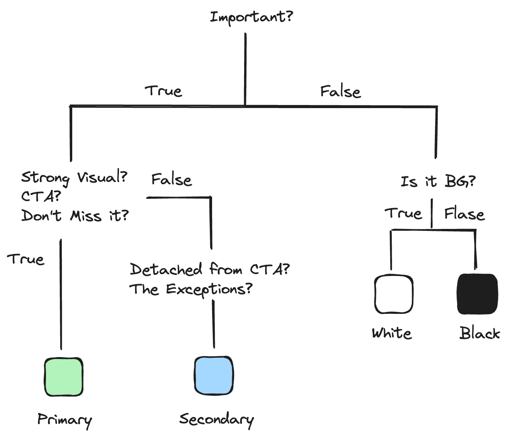

เนื่องจากช่วงนี้งานประจำที่ทำได้รับมอบหมายให้ขึ้นโปรเจคใหม่ทั้งหมด ทั้ง Frontend และ Backend
 . 
ด้วยความเป็น FullStack Dev ซึ้งไม่มีความรู้ด้านการ Design เลย แบบ เลยยย ก็เลยทำได้แค่ใช้[RealTime Color](https://www.realtimecolors.com/) สุ่มสีออกมาและยัดเข้า [Tailwind Theme Config.](https://tailwindcss.com/docs/theme) แล้วก็ใช้แบบตามสัญชาติญาณและประสบการณ์ที่สั่งสมมา
 . 
จนวันนึงนั่งไถไอจีไปเจอช่องนึง(เรียกช่องไหมนะ) ชื่อว่า [uxui_howard.le](https://www.instagram.com/uxui_howard.le) เป็นคลิปเกี่ยวกับการเลือกใช้สี โดยคุณลี(ต่อไปนี้ขออนุญาติเรียกแบบนี้) ใช้ Chart ในการ Visualized การเลือกสีให้ออกมาได้เข้าใจง่าย โดยวันนี้เราจะมาลองทำตาม Mr.Lee's Color Guide กัน

#### Mr.Lee's Color Guide

โดยไกด์ของ คุณลีเริ่มจาก Color Palette ทั้งหมด 4 สีด้วยกัน ประกอบด้วย

- Primary
- Secondary
- Black
- White

โดยหลังจากที่ได้ Palette มาเรียบร้อยแล้ว เราก็มาจับเข้าเงื่อนไขกัน
 . 
Object นั้นมีความสำคัญไหม?
 . 
ถ้ามี แล้วมันใช่ Call to Action ไหม?
 . 
ถ้าใช่ ให้ใช้ Primary และถ้าไม่ ให้ใช้ Secondary
 . 
เช่นกัน ถ้าไม่ได้มีความสำคัญ แล้วเป็นพื้นหลังไหม
 . 
ถ้าใช่ให้เหลือกสีดำหรือขาว แล้วอีกสีนึงเป็นสีตัวหนังสือ
 . 
เราจะได้ Chart หน้าตาประมาณนี้

พอเราได้หลักการการเลือกสีมาแล้ว เราก็ต้องมาลองทำจริงกัน

#### ลองทำจริงๆ

เนื่องจากเคสนี้เราไม่ได้จะทำเว็บจริงๆ เราเพียงต้องการลองสีเท่านั้น เราเลยเลือกใช้ Excalidraw ในการเขียน Wireframe ง่ายๆ ขึ้นมา ผลลัพธ์ตามนี้

ถึงเซนต์ด้านการออกแบบจะไม่ค่อยเพิ่มขึ้นสักเท่าไหร่แต่ Mr.Lee's Color Guide ก็ช่วยให้มีหลักการมากขึ้นในการเลือกใช้สีในการพัฒนาเว็บไซต์ มั้งนะ

**แหล่งข้อมูลอ้างอิง:**

- [
  uxui_howard.le's
  🛑 Stop color random picked. Steal my breakdown chart.
  ](https://www.instagram.com/reel/C-FvReRys8j/?utm_source=ig_web_copy_link&igsh=MzRlODBiNWFlZA==)

---
